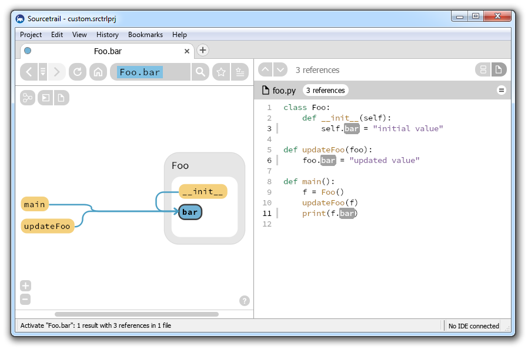
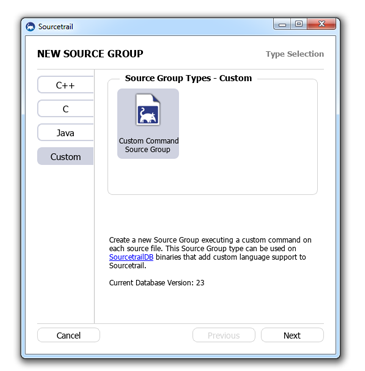
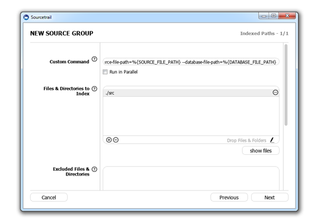
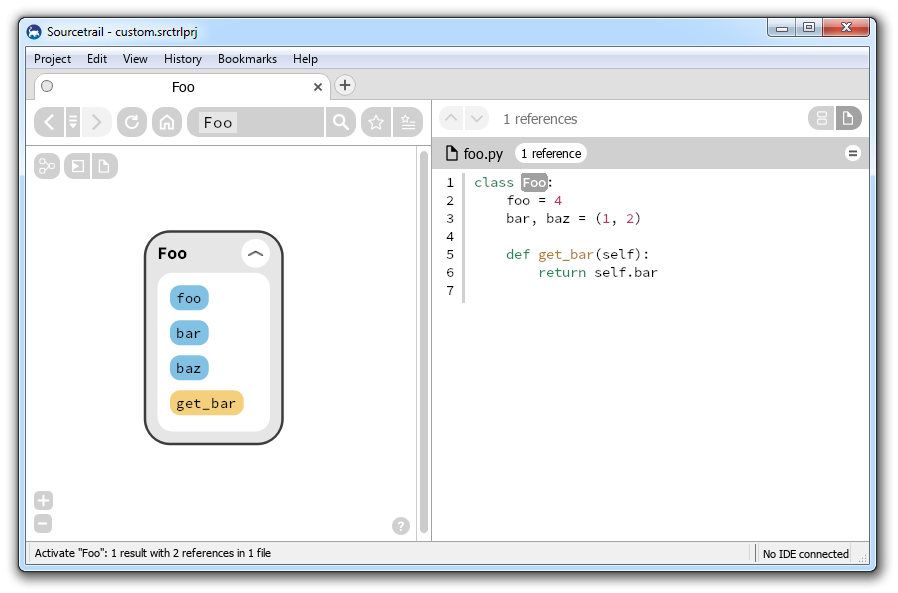
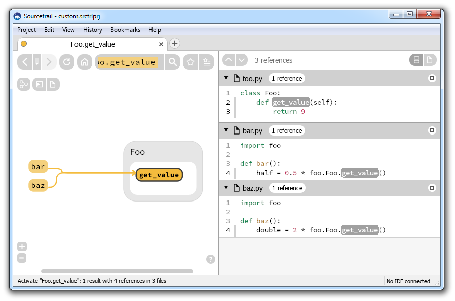
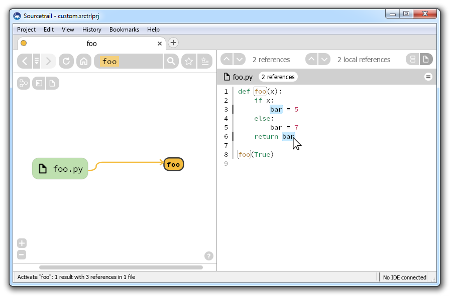

# SourcetrailPythonIndexer
Python Indexer for [Sourcetrail](https://www.sourcetrail.com/) based on [jedi](https://github.com/davidhalter/jedi), [parso](https://github.com/davidhalter/parso) and [SourcetrailDB](https://github.com/CoatiSoftware/SourcetrailDB)


## CI Pipelines
Windows: [](https://ci.appveyor.com/project/mlangkabel/sourcetrailpythonindexer/branch/master)

Linux and macOS: [](https://travis-ci.org/CoatiSoftware/SourcetrailPythonIndexer)

## Description
The SourcetrailPythonIndexer project is a Sourcetrail language extension that brings Python support to Sourcetrail. This project is still in a prototype state, but you can already run it on your Python code!




## Requirements
* [Python 3](https://www.python.org)
* [jedi 0.17.2](https://pypi.org/project/jedi/0.17.2)
* [parso 0.7.0](https://pypi.org/project/parso/0.7.0)
* [SourcetrailDB](https://github.com/CoatiSoftware/SourcetrailDB) Python bindings


## Setup
* Check out this repository
* Install jedi by running `pip install jedi`
* Download the SourcetrailDB Python bindings for your specific Python version [here](https://github.com/CoatiSoftware/SourcetrailDB/releases) and extract both the `_sourcetraildb.pyd` (`_sourcetraildb.so` on unix) and the `sourcetraildb.py` files to the root of the checked out repository


## Running the Source Code
To index an arbitrary Python source file, execute the command:

```
$ python run.py index --source-file-path=path/to/your/python/file.py --database-file-path=path/to/output/database/file.srctrldb
```

This will index the source file and store the data to the provided database filepath. If the database does not exist, an empty database will be created.

You can access an overview that lists all available commands by providing the `-h` argument, which will print the following output to your console:
```
$ python run.py -h
usage: run.py [-h] [--version] {index,check-environment} ...

Python source code indexer that generates a Sourcetrail compatible database.

optional arguments:
  -h, --help            show this help message and exit
  --version             show program's version number and exit

commands:
  {index,check-environment}
    index               Index a Python source file and store the indexed data
                        to a Sourcetrail database file. Run "index -h" for
                        more info on available arguments.
    check-environment   Check if the provided path specifies a valid Python
                        environment. This command exits with code "0" if a
                        valid Python environment has been provided, otherwise
                        code "1" is returned. Run "check-environment -h" for
                        more info on available arguments.
```

You can also view a detailed summary of all available arguments for the `index` command by providing the `-h` argument here. This will print the following output to your console:
```
$ python run.py index -h
usage: run.py index [-h] --source-file-path SOURCE_FILE_PATH
                    --database-file-path DATABASE_FILE_PATH
                    [--environment-path ENVIRONMENT_PATH] [--clear]
                    [--verbose] [--shallow]

optional arguments:
  -h, --help            show this help message and exit
  --source-file-path SOURCE_FILE_PATH
                        path to the source file to index
  --database-file-path DATABASE_FILE_PATH
                        path to the generated Sourcetrail database file
  --environment-path ENVIRONMENT_PATH
                        path to the Python executable or the directory that
                        contains the Python environment that should be used to
                        resolve dependencies within the indexed source code
                        (if not specified the path to the currently used
                        interpreter is used)
  --clear               clear the database before indexing
  --verbose             enable verbose console output
  --shallow             use a quick indexing mode that matches references by
                        name and ignores most of the context
```


## Running the Release

The availble [release packages](https://github.com/CoatiSoftware/SourcetrailPythonIndexer/releases) already contain a functional Python enviroment and all the dependencies. To index an arbitrary Python source file just execute the command:

```
$ path/to/SourcetrailPythonIndexer index --source-file-path=path/to/your/python/file.py --database-file-path=path/to/output/database/file.srctrldb
```


## Executing the Tests
To run the tests for this project, execute the command:
```
$ python test.py
$ python test_shallow.py
```


## Contributing
If you like this project and want to get involved, there are lots of ways you can help:

* __Spread the word.__ The more people want this project to grow, the greater the motivation for the developers to get things done.
* __Test the indexer.__ Run it on your own source code. There are still things that are not handled at all or edge cases that have not been considered yet. If you find anything, just create an issue here. Best, include some sample code snippet that illustrates the issue, so we can use it as a basis to craft a test case for our continuous integration and no one will ever break that case again.
* __Write some code.__ Don't be shy here. You can implement whole new features or fix some bugs, but you can also do some refactoring if you think that it benefits the readability or the maintainability of the code. Still, no matter if you just want to work on cosmetics or implement new features, it would be best if you create an issue here on the issue tracker before you actually start handing in pull requests, so that we can discuss those changes first and thus raise the probability that those changes will get pulled quickly.

To create a pull request, follow these steps:
* Fork the Repo on GitHub.
* Make your commits.
* If you added functionality or fixed a bug, please add a test.
* Add your name to the "Code Contributors" section in AUTHORS.txt file.
* Push to your fork and submit a pull request.


## Sourcetrail Integration
To run the lastest release of the Python indexer from within your Sourcetrail installation, follow these steps:
* download the latest [Release](https://github.com/CoatiSoftware/SourcetrailPythonIndexer/releases) for your OS and extract the package to a directory of your choice
* make sure that you are running Sourcetrail 2018.4.45 or a later version
* add a new "Custom Command Source Group" to a new or to an existing Sourcetrail project
* paste the following string into the source group's "Custom Command" field: `path/to/SourcetrailPythonIndexer index --source-file-path=%{SOURCE_FILE_PATH} --database-file-path=%{DATABASE_FILE_PATH}`
* add your Python files (or the folders that contain those files) to the "Files & Directories to Index" list
* add a ".py" entry to the "Source File Extensions" list (including the dot)
* confirm the settings and start the indexing process




## Features



View a class' internal structure to find out which member functions and variables are available and where they are defined.

<br />


Find out where a member variable is actually coming from and where it is accessed.

<br />



Inspect call sites of functions all accross the code base.

<br />



View the definitions of local variables and their usages (note that the definition of `bar` in the `else` branch is not highlighted).
